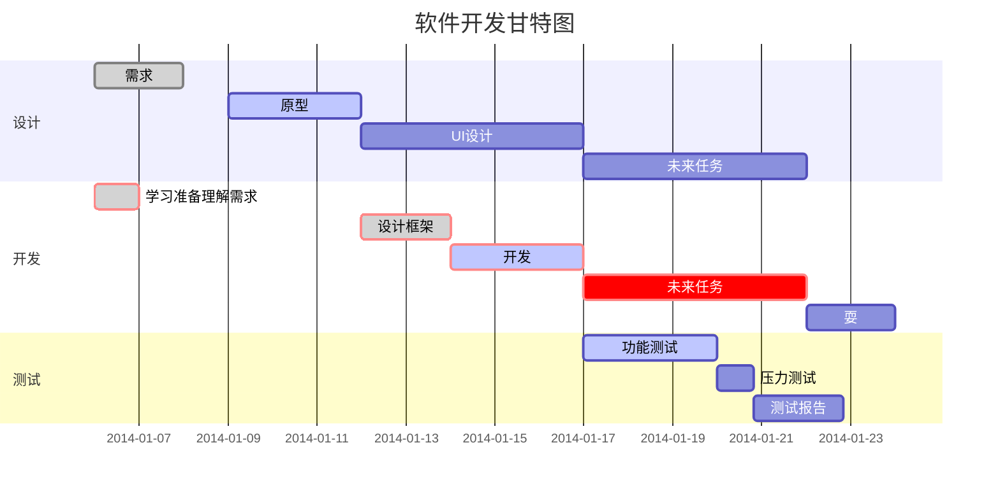

# 一级
## 二级
    这是一段
        这是第二段  
    

*斜体文本*  

_斜体文本_  

**粗体文本**  

-----------------------------------

__粗体文本__  

****************************************************

~~***粗斜体文本***~~  

___粗斜体文本___    

创建脚注格式类似这样 [^RUNOOB]。

[^RUNOOB]: 菜鸟教程 -- 学的不仅是技术，更是梦想！！！

* 第一项
* 第二项
* 第三项

+ 第一项
+ 第二项
+ 第三项

- 第一项
- 第二项
- 第三项

1. 第一项
2. 第二项
3. 第三项  

    1. 第一项：
        - 第一项嵌套的第一个元素
        - 第一项嵌套的第二个元素
    2. 第二项：
        - 第二项嵌套的第一个元素
        - 第二项嵌套的第二个元素

> 区块引用  
> 菜鸟教程  
> 学的不仅是技术更是梦想

> 最外层
> > 第一层嵌套
> > > 第二层嵌套

> 区块中使用列表
    > 1. 第一项
    > 2. 第二项
    > + 第一项
    > + 第二项
    > + 第三项

* 第一项
    > 菜鸟教程  
    > 学的不仅是技术更是梦想
* 第二项

--------------------------------
    '''c
    #include <stdio.h>
    {
        int main()
        {
            return 0;
        }
    }
    '''

----------------------------------------------------
这是一个链接 [菜鸟教程](https://www.runoob.com)

----------------------------------------------------

<https://www.runoob.com>

----------------------------------------------------

-------------------------------------

这个链接用 1 作为网址变量 [RUNOOB][1].
然后在文档的结尾为变量赋值（网址）

[1]: http://static.runoob.com/images/runoob-logo.png

-------------------------------------

|  表头            | 表头  |
| :-----:         | :----:  |
| 单元格   fawefwfoawjfoanfnefnvwao        | 单元格 |
| 单元格           | 单元格 |
| 单元格           | 单元格 |
| 单元格           | 单元格 |
| 单元格           | 单元格 |

--------------

| 左对齐 | 右对齐 | 居中对齐 |
| :-----| ----: | :----: |
| 单元格 | 单元格 | 单元格 |
| 单元格 | 单元格 | 单元格 |

--------------------------------

8、甘特图样例：

DEMO
===========================

########### 环境依赖  
node v0.10.28+
redIs ~

###########部署步骤
1. 添加系统环境变量
    export $PORTAL_VERSION="production" // production, test, dev

2. npm install  //安装node运行环境

3. gulp build   //前端编译

4. 启动两个配置(已forever为例)
    eg: forever start app-service.js
        forever start logger-service.js
 

----------------------  

###########目录结构描述  

├── Readme.md                   // help
├── app                         // 应用
├── config                      // 配置
│   ├── default.json
│   ├── dev.json                // 开发环境
│   ├── experiment.json         // 实验
│   ├── index.js                // 配置控制
│   ├── local.json              // 本地
│   ├── production.json         // 生产环境
│   └── test.json               // 测试环境
├── data
├── doc                         // 文档
├── environment
├── gulpfile.js
├── locales
├── logger-service.js           // 启动日志配置
├── node_modules
├── package.json
├── app-service.js              // 启动应用配置
├── static                      // web静态资源加载
│   └── initjson
│       └── config.js         // 提供给前端的配置
├── test
├── test-service.js
└── tools

---------------------

###########V1.0.0 版本内容更新
1. 新功能     aaaaaaaaa
2. 新功能     bbbbbbbbb
3. 新功能     ccccccccc
4. 新功能     ddddddddd